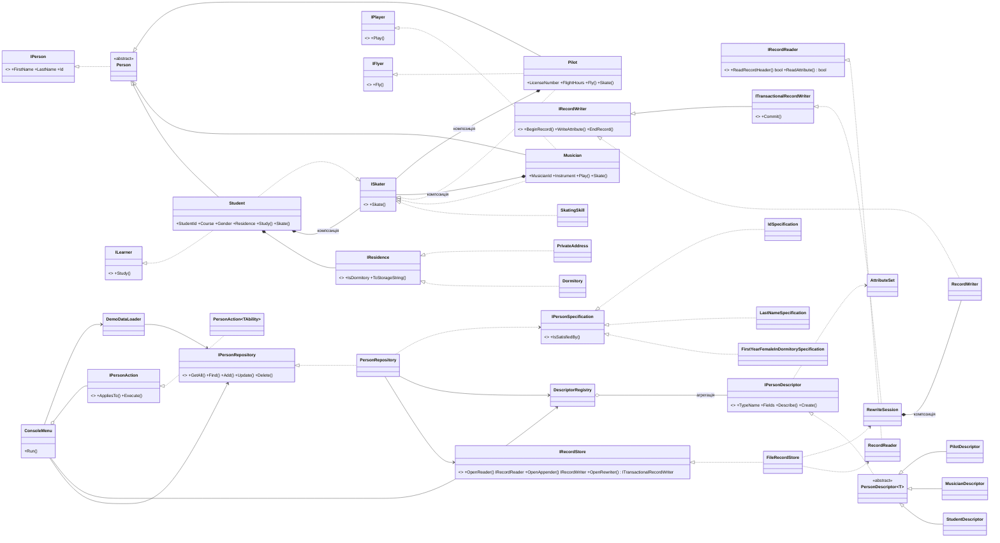

# Діаграма класів (Mermaid)

```mermaid
classDiagram
direction LR

%% ---------- FileStorage (лише файловий ввід-вивід) ----------
class IRecordStore { <<interface>> +OpenReader() IRecordReader +OpenAppender() IRecordWriter +OpenRewriter() ITransactionalRecordWriter }
class IRecordReader { <<interface>> +ReadRecordHeader() bool +ReadAttribute() bool }
class IRecordWriter { <<interface>> +BeginRecord() +WriteAttribute() +EndRecord() }
class ITransactionalRecordWriter { <<interface>> +Commit() }
class FileRecordStore
class RecordReader
class RecordWriter
class RewriteSession
IRecordStore <|.. FileRecordStore
IRecordReader <|.. RecordReader
IRecordWriter <|.. RecordWriter
IRecordWriter <|-- ITransactionalRecordWriter
ITransactionalRecordWriter <|.. RewriteSession
RewriteSession *-- RecordWriter : композиція
FileRecordStore ..> RecordReader
FileRecordStore ..> RewriteSession

%% ---------- Сутності ----------
class IPerson { <<interface>> +FirstName +LastName +Id }
class Person { <<abstract>> }
class Student { +StudentId +Course +Gender +Residence +Study() +Skate() }
class Musician { +MusicianId +Instrument +Play() +Skate() }
class Pilot { +LicenseNumber +FlightHours +Fly() +Skate() }
IPerson <|.. Person
Person <|-- Student
Person <|-- Musician
Person <|-- Pilot

class IResidence { <<interface>> +IsDormitory +ToStorageString() }
class Dormitory
class PrivateAddress
IResidence <|.. Dormitory
IResidence <|.. PrivateAddress
Student *-- IResidence

%% ---------- Вміння (інтерфейси) ----------
class ILearner { <<interface>> +Study() }
class IPlayer { <<interface>> +Play() }
class IFlyer { <<interface>> +Fly() }
class ISkater { <<interface>> +Skate() }
class SkatingSkill
ISkater <|.. SkatingSkill
ILearner <|.. Student
ISkater <|.. Student
IPlayer <|.. Musician
ISkater <|.. Musician
IFlyer <|.. Pilot
ISkater <|.. Pilot
Student *-- ISkater : композиція
Musician *-- ISkater : композиція
Pilot *-- ISkater : композиція

%% ---------- Відображення на файл ----------
class IPersonDescriptor { <<interface>> +TypeName +Fields +Describe() +Create() }
class PersonDescriptor~T~ { <<abstract>> }
class StudentDescriptor
class MusicianDescriptor
class PilotDescriptor
class DescriptorRegistry
class AttributeSet
IPersonDescriptor <|.. PersonDescriptor
PersonDescriptor <|-- StudentDescriptor
PersonDescriptor <|-- MusicianDescriptor
PersonDescriptor <|-- PilotDescriptor
DescriptorRegistry o-- IPersonDescriptor : агрегація
IPersonDescriptor ..> AttributeSet

%% ---------- Специфікації та репозиторій ----------
class IPersonSpecification { <<interface>> +IsSatisfiedBy() }
class FirstYearFemaleInDormitorySpecification
class LastNameSpecification
class IdSpecification
IPersonSpecification <|.. FirstYearFemaleInDormitorySpecification
IPersonSpecification <|.. LastNameSpecification
IPersonSpecification <|.. IdSpecification

class IPersonRepository { <<interface>> +GetAll() +Find() +Add() +Update() +Delete() }
class PersonRepository
IPersonRepository <|.. PersonRepository
PersonRepository --> IRecordStore
PersonRepository --> DescriptorRegistry
PersonRepository ..> IPersonSpecification

%% ---------- Застосунок ----------
class ConsoleMenu { +Run() }
class IPersonAction { <<interface>> +AppliesTo() +Execute() }
class PersonAction~TAbility~
class DemoDataLoader
IPersonAction <|.. PersonAction
ConsoleMenu --> IPersonRepository
ConsoleMenu --> DescriptorRegistry
ConsoleMenu o-- IPersonAction
ConsoleMenu --> DemoDataLoader
DemoDataLoader --> IPersonRepository
```
